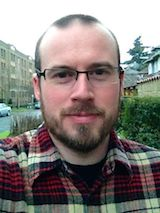

  

    
  

I am a postdoc in the department of Computer Science and Engineering at the University of Washington. I was formerly a grad student in the [Sampa](http://sampa.cs.washington.edu) research group at UW CSE; I completed my Ph.D. in December 2014 under the supervision of [Luis Ceze](http://www.cs.washington.edu/homes/luisceze/), [Mark Oskin](http://www.cs.washington.edu/homes/oskin), and [Simon Kahan](http://www.systemsbiology.org/simon-kahan).

My interests are in the areas of computer architecture and runtime systems for big data and high-performance computing. My primary project is [Grappa](http://grappa.io), a runtime system designed to improve the performance of data-intensive irregular applications on commodity clusters. I have also worked in approximate computing, deterministic parallel computing, and speculative multithreading.

[My CV](pubs/jacob-nelson-cv.pdf)

[My Thesis](pubs/jacob-nelson-thesis.pdf)

Publications
------------

- **[Latency-Tolerant Software Distributed Shared Memory](https://www.usenix.org/system/files/conference/atc15/atc15-paper-nelson_update.pdf)**. J. Nelson, B. Holt, B. Myers, P. Briggs, L. Ceze, S. Kahan, M. Oskin. Best paper at *USENIX ATC*, July 2015.

- **Scalable Adaptive Label Propagation in Grappa**. G. Farnadi, Z. Mahdavifar, I. Keller, J. Nelson, A. Teredesai, M.-F. Moens, M. De Cock. Special Session on Intelligent Mining, *IEEE Big Data 2015*, October 2015.
  
- **Using the Parallel Research Kernels to Study PGAS Runtimes**. R. Van der Wijngaart, S. Sridharan, A. Kayi, G. Jost, J. Hammond, T. Mattson, J. Nelson. *International Conference on PGAS Programming Models (PGAS)*, September 2015.

- **A 10G NetFPGA Prototype for In-Network Aggregation**. V. Lee, J. Nelson, M. Oskin, L. Ceze. *Workshop on Architectural Research Prototyping (WARP w/ISCA)*, June 2015.

- **[SNNAP: Approximate Computing on Programmable SoCs via Neural Acceleration](http://sampa.cs.washington.edu/papers/snnap-hpca2015.pdf)**. T. Moreau, M. Wyse, J. Nelson, A. Sampson, H. Esmaeilzadeh, L. Ceze, M. Oskin. In *[HPCA 2015](http://darksilicon.org/hpca/)*.

- **[Radish: Compiling Efficient Query Plans for Distributed Shared Memory](ftp://ftp.cs.washington.edu/tr/2014/10/UW-CSE-14-10-01.pdf)**. B. Myers, D. Halperin, J. Nelson, M. Oskin, B. Howe. *UW CSE Tech Report 14-10-01*, 2014.

- **[Grappa: A Latency-Tolerant Runtime for Large-Scale Irregular Applications](http://sampa.cs.washington.edu/papers/grappa-wrsc-2014.pdf)**. J. Nelson, B. Holt, B. Myers, P. Briggs, L. Ceze, S. Kahan, M. Oskin. *[International Workshop on Rack-Scale Computing (WRSC w/EuroSys)](http://research.microsoft.com/en-us/events/wrsc2014/)*, April 2014.

- **[Approximate Storage in Solid-State Memories](http://homes.cs.washington.edu/~asampson/media/papers/approxstorage-micro2013.pdf)**. A. Sampson, J. Nelson, K. Strauss, L. Ceze. In *[MICRO 2013](http://www.microarch.org/micro46/)*. Selected to appear as an expanded version in [ACM TOCS](http://tocs.acm.org/).

- **[Flat Combining Synchronized Global Data Structures](http://homes.cs.washington.edu/~bholt/pubs/holt-pgas13.pdf)**. B. Holt, J. Nelson, B. Myers, P. Briggs, L. Ceze, S. Kahan, M. Oskin. *[7th International Conference on PGAS Programming Models (PGAS)](http://www.pgas2013.org.uk/)*, October 2013.

- **[Crunching large graphs with commodity processors](https://www.usenix.org/legacy/event/hotpar11/tech/final_files/Nelson.pdf)**. J. Nelson, B. Myers, A. H. Hunter, P. Briggs, L. Ceze, C. Ebeling, D. Grossman, S. Kahan, M. Oskin. In *[HOTPAR 2011](https://www.usenix.org/legacy/events/hotpar11/index.html)*.

- **[RCDC: A Relaxed Consistency Deterministic Computer](http://www.cs.washington.edu/homes/devietti/papers/devietti.rcdc.asplos.2011.pdf)**. J. Devietti, J. Nelson, T. Bergan, L. Ceze, D. Grossman. In *[ASPLOS 2011](http://asplos11.cs.ucr.edu/)*.

- **[Dynamic Concurrency Discovery for Very Large Windows of Execution](http://homes.cs.washington.edu/~nelson/Nelson-ConcurrencyDiscovery-PESPMA2009.pdf)**. J. Nelson, L. Ceze. In *PESPMA 2009*.

