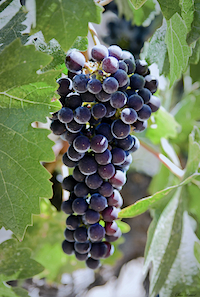

## [Grappa](http://sampa.cs.washington.edu/grappa)

  

Starting Fall 2011 to now, I am working on a project at the University of Washington with several other grad students and faculty. The goal of the project is to enable efficient computation of irregular applications on commodity clusters (i.e. supercomputers). "Irregular applications" are those which accesses memory in unpredictable ways with little spatial or temporal locality, such as many graph analysis problems. These have traditionally performed terribly under the communication model of supercomputers and cloud datacenter resources which rely on doing as little communication over the high-latency network as possible. The machine that people interested in solving such problems as finding the most influential people in a social network have turned to the Cray XMT which has terabytes of RAM and special "Threadstorm" processors that enable massive parallelism which helps to hide the long latency. Our project, dubbed "Grappa", has the goal of duplicating the good performance the XMT gets on irregular applications through software alone. We are building a runtime system with lightweight user-level threading, delegation-based synchronization, memory request aggregation that should enable higher performance for irregular applications. Our group has published one paper describing and validating our method. This paper and more information can be found on our [project page](http://sampa.cs.washington.edu/grappa).
### Flat combining
- [Flat Combining Synchronized Global Data Structures](papers/holt-pgas13.pdf)

### Task migration simulation
[Brandon Myers](http://www.cs.washington.edu/homes/bdmyers/) and I submitted a workshop paper to [HotPar '12](https://www.usenix.org/conference/hotpar12) exploring whether it is possible to make profitable predictions about when to move a task its the data (migration) rather than moving the data. Our study involved instrumenting the shared memory accesses in a few simple benchmarks, collecting an execution trace, and simulating the cost of data movement under different migration policies, including an optimal migration schedule. More details can be found in the [paper](https://www.usenix.org/system/files/conference/hotpar12/hotpar12-final46.pdf).

---

## Tools
### [Igor](http://github.com/bholt/igor)

  

This project was born out of necessity when we wanted to be able to collect output from many experiments in Grappa and related projects. We also needed a way to easily enumerate a large multi-variate parameter space, especially when trying to find the right parameters to maximize performance for Grappa. This script aims to help with generating a large number of experiments, parsing their output, and storing experiment inputs and outcomes to a SQLite database automatically. For now, it simply supports having a static script that runs all the experiments in a single batch and gathers the results automatically. We would like to make the experience more interactive, where a prompt can be used to schedule new parameter sweeps, monitor progress of existing experiments, inspect gathered data points, and visualize preliminary results. A complete re-write to support this goal will probably happen--eventually.

---

### [Project Archive](old_projects.html)